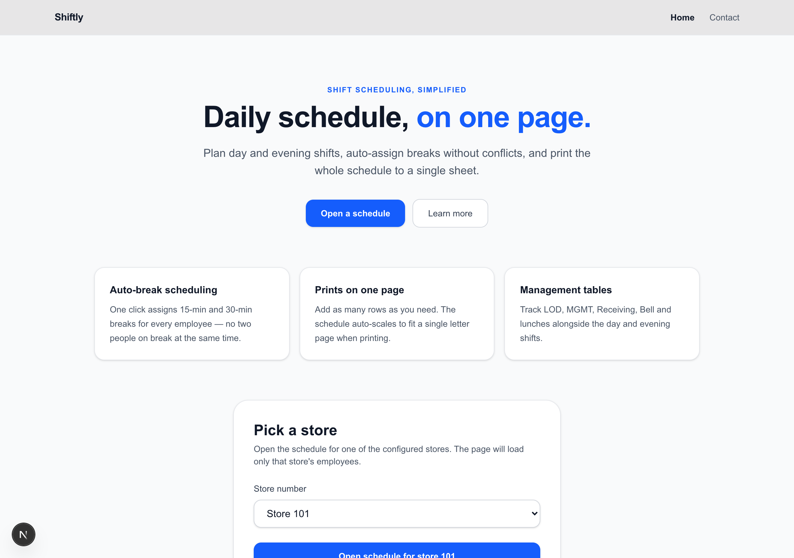
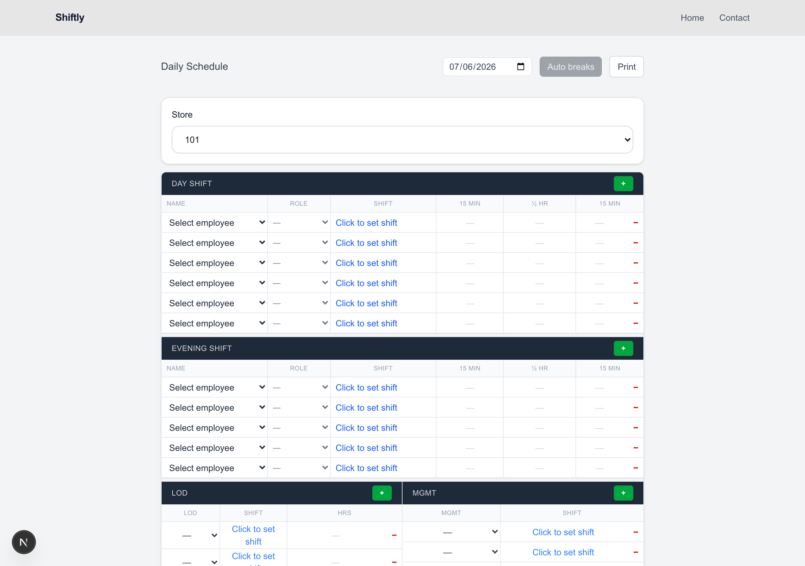
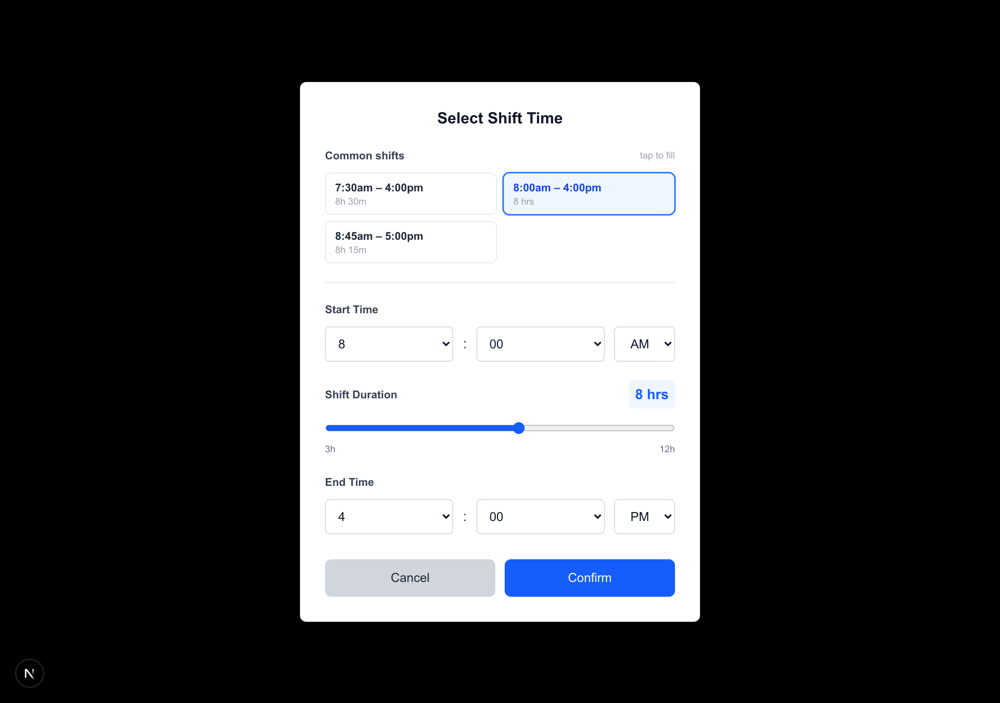

# Shiftly

A single-page web app for building daily store schedules: assign day and evening
shifts, auto-generate breaks that never overlap, track management tables, and
print the whole thing on one letter page.

Built with **Next.js 16 (App Router)**, **React 19**, **TypeScript**, and
**Tailwind CSS 4**.

---

## Key features

### 🗓️ Day & Evening shift tables
Assign employees to shifts with a name dropdown (loaded per store), a role
column, and a visual shift-time picker. Add or remove rows on the fly.

### ⏱️ Shift picker with common shifts
Clicking a shift cell opens a picker with **quick-pick "Common shifts"** — the
slots shown depend on the table (Day, Evening, MGMT) and are designed to be
**per-store and database-ready**. Pick a common shift in one tap, or set the
start time and duration manually; the end time updates automatically.

### ☕ One-click auto-breaks
The **Auto breaks** button fills every employee's breaks following real
scheduling rules:

- **7–8 hr shift** → 15 min + 30 min lunch + 15 min
- **6 hr shift** → 15 min + 15 min (no lunch)
- **≤5 hr shift** → a single 15 min break

The scheduler guarantees:
- **No two people are ever on break at the same time** (the 30-min lunch
  reserves its full half hour).
- **Breaks stay inside the shift** — the first break is ~2 h after the start,
  the last is ~2 h before the end, so nothing spills past clock-out.
- **Managers are skipped** automatically — they run the floor and take breaks
  ad hoc.

### 🧰 Management tables
Alongside the shifts, track **LOD, MGMT, Receiving, Bell, and Management
Lunches**. Name columns are filtered by role (e.g. MGMT lists managers and
supervisors, Receiving lists receiving staff), and HRS auto-fills from the
chosen shift.

### 🖨️ Prints on one page
Add as many rows as you need — when you print, the schedule **auto-scales to fit
a single letter page**. UI-only controls (buttons, selectors, warnings) are
hidden, and a compact store + date header is shown instead.

### 🏬 Multi-store, env-based data
Employee directories are keyed by store number and loaded from an environment
variable, so each store sees only its own staff.

---

## Screenshots

### Home
Landing page with the feature highlights and a "pick a store" call to action.



### Schedule builder
Day & Evening shift tables, store selector, Auto breaks, and the management
tables below.



### Shift picker
Common-shift quick-pick cards (with the active shift highlighted) plus manual
start / duration / end controls.



---

## Getting started

```bash
npm install
npm run dev      # start the dev server at http://localhost:3000
npm run build    # production build + TypeScript check
npm run lint     # ESLint
```

> Requires **Node.js 20+** (Next.js 16 uses modern JS syntax).

### Employee data

Employee directories live in `.env.local` as a single `EMPLOYEE_DATA` JSON
string keyed by store number:

```env
EMPLOYEE_DATA={"101":[{"name":"Ali","role":"Supervisor, Tech"}],"464":[]}
```

The API route at `src/app/api/employees/route.ts` reads this and serves
`/api/employees?store={id}`.

---

## Project structure

```
src/
├─ app/
│  ├─ page.tsx              # home / landing page
│  ├─ contact/page.tsx      # contact page
│  ├─ schedule/page.tsx     # the schedule builder
│  └─ api/employees/route.ts
├─ components/schedule/      # shift tables, info tables, pickers, navbar
├─ hooks/
│  ├─ useSchedule.ts        # all schedule state + handlers
│  └─ usePrintScale.ts      # dynamic print-to-one-page scaling
├─ utils/                    # pure logic: time math, break scheduling, filters
└─ constants/                # break rules, shift presets, store options
```

State and business logic are kept in **hooks and pure utility functions**,
separate from the UI components — making the logic portable and easy to test.
